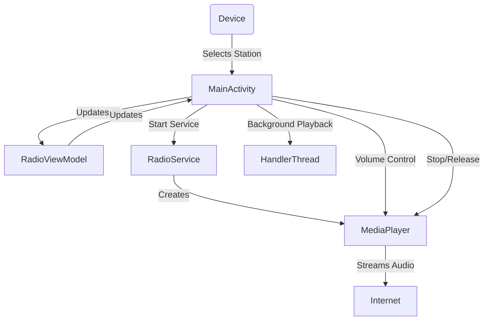
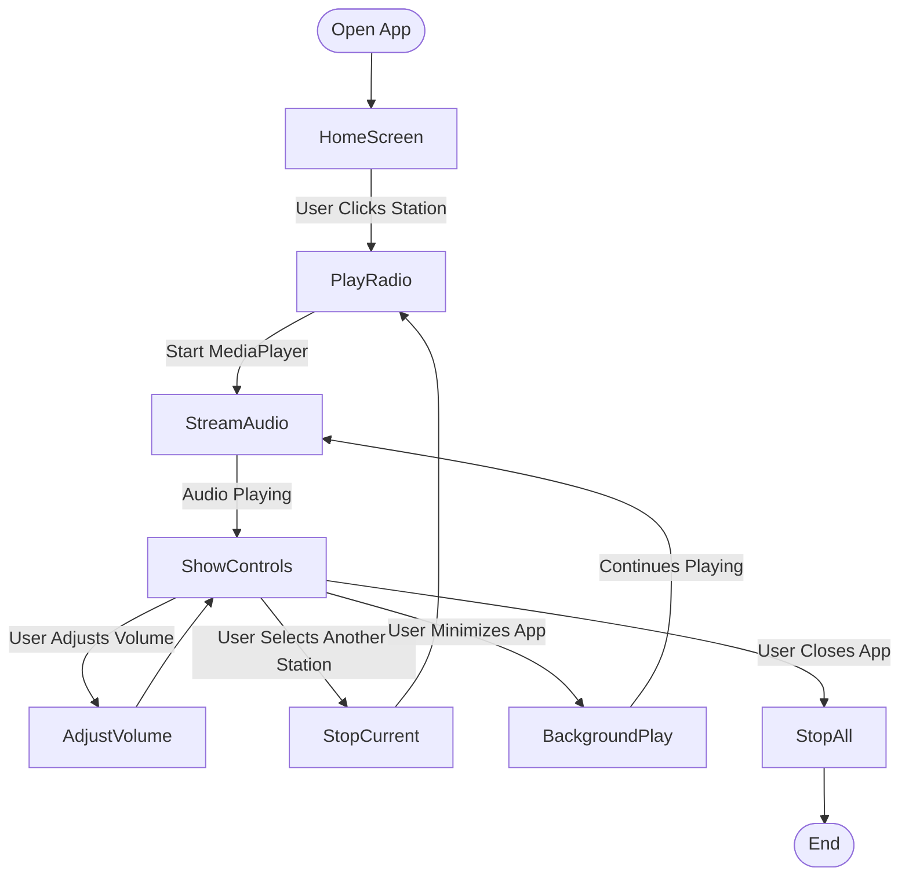

# 📻 Kotlin Internet Radio App – Lab 5

This is a fully functional **Internet Radio** Android app built with **Jetpack Compose**.  
It was developed for Lab 5 of Mobile App Development, fulfilling all core requirements.

---

## ✅ Features

- 🎧 Stream from **10 Internet Radio Stations**
- 🖼️ Custom station **images**
- 🔊 **Volume Up / Down** controls
- 🎮 **Play / Pause** per station
- 🚀 Runs **MediaPlayer on a HandlerThread** (background-safe)
- 📲 **Plays audio in background** using ForegroundService
- 🔔 **Notification controls** for playback while app is backgrounded

---

## 📷 Screenshots & Diagrams

### App Architecture

---

### User Flow

---

## 🚀 How to Run

1. Clone the repo
2. Open in **Android Studio**
3. Run the app on emulator/device
4. Tap any station to start streaming 🎶

---

## 📁 Submission Files

- ✅ `internet_radio_documentation_fixed.pdf` – official submission document

---

## 🛠 Tech Stack

- Jetpack Compose
- Kotlin
- MediaPlayer
- HandlerThread / Looper
- ForegroundService + Notification

---

## 📄 License

This project is licensed under the [MIT License](LICENSE).